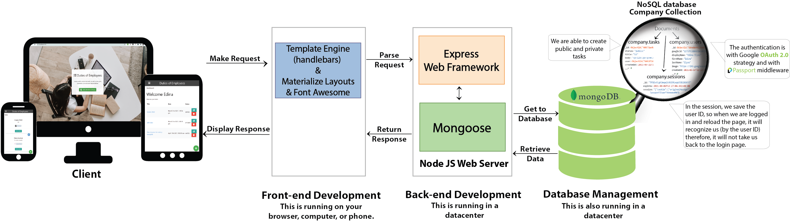
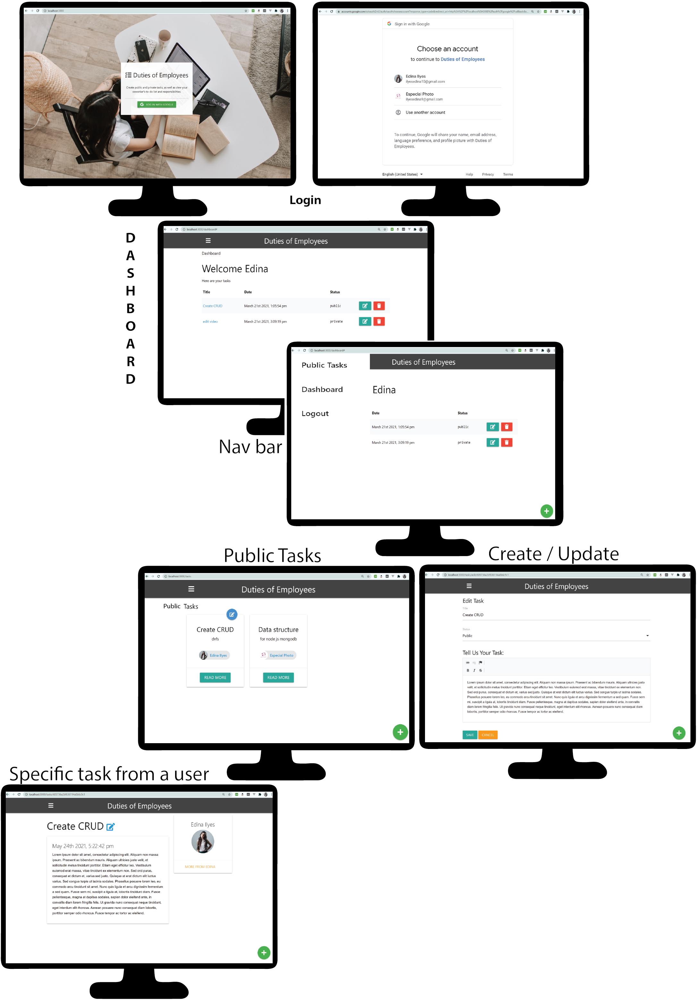

# Duties of Employees app

> Create public and private tasks(CRUD). You can also see your coworkers to-do list and responsibilities.

This app uses Node.js/Express/MongoDB with Google OAuth for authentication

## Data flow


## User flow


## Usage
Add your mongoDB URI and Google OAuth credentials to the config.env file

```
# Run in development
npm run dev

# Run in production
npm start
```

## Moscow


## Website wireframe


